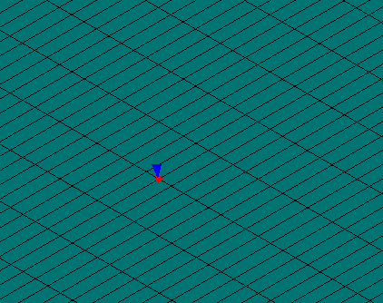
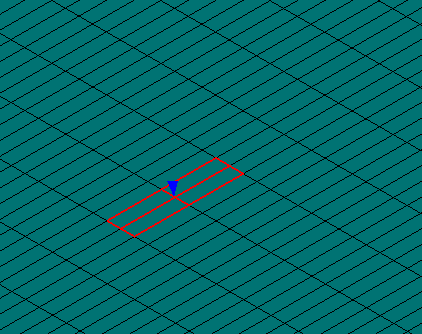

# Abaqus Python Scripts that Extract Time History of Eulerian Results

This project develops two general-purpose Abaqus Python scripts based on two methods that can automatically extract the time history of field outputs at some spatial location of interest. The developer wishes the scripts can save some labor and willpower of analysts so their energy can be reserved for pure problem solving rather than tedious external processing.

## Physical Quantities in Lagrangian and Eulerian Representations
Essentially, physical quantities in solid mechanics are attached to material bodies to describe the state or property of material. Quantities of a material body can vary among its material points and change in time, thus mathematically, a physical quantity *Q* can be expressed as a function of material point *p* and time *t*:

 
### Lagrangian Representation
In Lagrangian representation, we select a time instant and use the configuration of material body at that instant as a reference configuration. We build up a coordinates system in space at reference instant and label each material point by the coordinates it occupies at that instant. So each material point is mapped to a set of coordinates in the reference configuration by a mapping *R*:

The inverse mapping maps the coordinates in reference configuration back to a material point *p*: 

We can replace the argument of material point in the physical quantity function by the Lagrangian coordinates due to their one-to-one correspondence: 

### Eulerian Representation
In Eulerian representation, we label each material point by the spatial coordinates it occupies at each instant *t*, rather than at one reference instant in Lagrangian description. Since at different time instants, the spatial coordinates the material point occupies is probably different due to the deformation, the label of one material point at different instants is different. Therefore, the mapping between material point and spatial coordinates is time-dependent, namely :

Similarly, the inverse mapping maps a set of spatial coordinates back to the material point that occupies that spatial coordinates, but at the specific time instant *t*:

Again, we can replace the argument of material point in the function of a physical quantity:

### Transformation between Lagrangian and Eulerian Representations

## Extracting Time History of Eulerian Results
### Path Method
Abaqus, in post-processing, allows users to create a spatial points based path and extract results from the path in each single solution frame. Thus, we can create a super short path centered at our requested  to take advantage of this built-in tool. The extracted results from path have multiple values since Abaqus at least extracts results at path's start and end points. We take the average value of results obtained from path as the result for .  This extraction process is automated to loop over all solution frames to obtain the time history result, from which a XYData object and XYPlot will be generated by the script.

The method should gives the best accuracy of Eulerian result we can expect from a finished ODB file. Also, the method runs fast since the data extraction from path is implemented internally by Abaqus. 

The main limitation is the path has to intersect with some material body, from which the field output is extracted. There exists instances where as the deformation progresses, the path that intersects with material initially no long later. If this happens the method fails to extract field value. Another minor limitation is the method indifferently extracts results from material that intersects with the path and does not distinguish instance of part in a model. Thereby, if we only want to extract results at a requested  from a specific instance of part of the model, we cannot use this method. Lastly, 
in cases the method works fine, the accuracy of extraction is controlled by length of the short path, which is made as an input in the script. Users should examine the intersection of path and material body to make sure an appropriate condition.

To bypass these limitations,  I implemented a second method, which is based on finding the closest node and extract results based on the node with approximation. 

### Closest Node Method
This method is based on finding the node  from the input instance of the model that is closest to the requested , at each solution frame *t*, then, extracting the value of requested field output with the following approximation:
- for node-based results, the method directly returns the result from the closest node 
  
  
  

- for element-based results, the method further finds all elements that shares the closest node , and average results at each integration point  of all those elements  with a total number of integration points of , regardless of full integration or reduced integration, and for beam, membrane, shell elements only considers in-plane integration points
 
 
 
 

The advantage of this method is the there always exists a closest node  to the spatial point , even if the material moves out of it. The second example problem next shows a case where even the material has moved out of , the result extracted from  is still want we want.

The drawback of this method is its expensive running time. Finding the closest node requires the current coordinates of each node, however, this output labeled by 'COORD' in Abaqus is not a default output. In this case, the current coordinates of each node have to be calculated from initial coordinates and displacements at each solution frame, which takes time. Thus, a potential node label series is made as an input to reduce the number of nodes that's in the searching range, of which the current coordinates calculation are required. If the Abaqus ODB file has 'COORD' output, the script will directly use this for computation, which would significantly reduce running time.

## How to Use
### Modify scripts
#### EulerianExtractorPathBased.py
Path based method script has 5 inputs at the beginning of the source file that users need to modify to run:
1. ODB file name
	`odbName` is a string type variable that defines the file name of the ODB file whose results need to be extracted. It is recommended to input only file name without path and run the script from the directory contains ODB file. 
	
2. Point of interest
	`poi` is a tuple of three float numbers that define the (x, y, z) coordinates of the spatial location at which the Eulerian results are extracted.  
	
3. Name of field output variable 
	`fieldVarName` is a string that defines the name of field output.
	
4. Component of field output
	`fieldVarComponent` is a string that defines the component or invariant of the field output of interest if it is a vector or tensor.
	Possible component values for vectors: 
	1, 2, 3
	Possible component values for 2nd order tensors: 
	11, 22, 33, 12, 13, 23
	Possible invariant values: 
	Magnitude, Mises, Tresca, Pressure, Third Invariant, Max. Principal, Mid. Principal, Min. Principal, Max. In-Plane Principal, Min. In-Plane Principal, Out-of-Plane Principal
	Noted to put those keyword in quotation mark.
5. Tolerance
	`tol` is a float that defines the length of the path whose midpoint locates at `poi`. It is an important parameter. A success extraction requires the path to intersect with the material body in the model. If `tol` is too small, especially when the material body out of interest is a shell or a beam, the short path may not intersect with the material body considering the vibration in the simulation. On the other side, if it is too large, a longer path will extract results from a greater volume or area around `poi`, which may be off at some extent.
	
An example of the input to the path based script looks like:	
''odbName = 'Job-4.odb'
''poi = (-2.5, -1, 0)
''fieldVarName = 'V'
''fieldVarComponent = 'Magnitude' 
''tol = 1e-2
#### EulerianExtractorClosestNode.py
Closest node based method script has 6 inputs at the beginning of the source file that users need to modify to run:
1. ODB file name
	`odbName` is a string type variable that defines the file name of the ODB file whose results need to be extracted. It is recommended to input only file name without path and run the script from the directory contains ODB file. 
2. Point of interest
	`poi` is a tuple of three float numbers that define the (x, y, z) coordinates of the spatial location at which the Eulerian results are extracted.  
3. Name of field output variable 
	`fieldVarName` is a string that defines the name of field output.
4. Component of field output
	`fieldVarComponent` is a string that defines the component or invariant of the field output of interest if it is a vector or tensor. Possible values of vector and higher order tensor are same with that of the path based script, while possible values for invariants have a different form:
	MAGNITUDE, MISES, TRESCA, PRESS, INV3, MAX\_PRINCIPAL, MID\_PRINCIPAL, MIN\_PRINCIPAL, MAX\_INPLANE\_PRINCIPAL, MIN\_INPLANE\_PRINCIPAL, OUTOFPLANE\_PRINCIPAL
5. Instance Name
	`instanceName` is a string that defines the name of the instance in the model from which the results are to be extracted.
6. Potential nodes search range
	`potentialNodeRange` is a string that defines the potential nodes search ranges for the closest node. The purpose of this input is to reduce computational cost. If it is left black, all the nodes in the instance of `instanceName` will be searched. The format of the string adopts that of Abaqus to define node list, specifically a comma separates individual node labels and a colon separates a series of nodes labels in the format of start:end:inc. For example, `1,3:8:2` returns nodes of label `1,3,5,7`
An example of the closest node based script look like:
''odbName = 'Job-4.odb'
''poi = (-2.5, -1, 0)
''fieldVarName = 'V'

### Run scripts
1. Run in Abaqus/CAE from "File - Run Script"
2. Run in Abaqus/CAE from kernel command interface 
3. Run from command line
## Example 
to be added